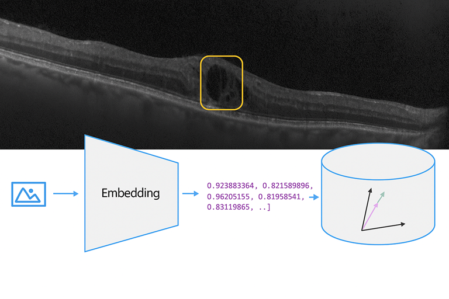

# Introduction

This repo holds data, infrastructure and python scripts to ingest and query for images using the medimageinsight embeddings model.

# Motivation

Embeddings models provide a robust way to capture the semantic information of images, enabling efficient and meaningful indexing. By converting images into high-dimensional vectors, these models facilitate similarity searches, clustering, and classification tasks. The potential benefits include improved retrieval accuracy, reduced computational overhead, and the ability to uncover hidden patterns within image datasets.

# MedImageInsight

The specific embeddings model used in this repo. can be found here:


# Setup Azure Infrastructure

Issue the following commands: 
```
azd login
azd up
```

Then issue the following command to grant a role:
az cosmosdb sql role assignment create --account-name "cosmos-<your_cosmos_account_name>" --resource-group "<your_resource_group>" --scope "/" --principal-id $(az ad signed-in-user show --query id -o tsv) --role-definition-id "00000000-0000-0000-0000-000000000002"

# Setup local Pyhton Environment

Run the following commands to setup a python virtual env.

```
python -m venv .venv
[windows].venv\Scripts\activate
[linux]source .venv/bin/activate
pip install -r requirements.txt
```

# Ingestion and Querying

to ingest files into cosmosdb using embeddings model execute the following command:

```
az cosmosdb sql role assignment create --account-name "cosmos-<redacted>" --resource-group "cosmodb-<redacted>" --scope "/" --principal-id $(az ad signed-in-user show --query id -o tsv) --role-definition-id "00000000-0000-0000-0000-000000000002"
```

`python ingest.py`

to query files execute the following command:

`python query.py`

Here is a visual of this process :


